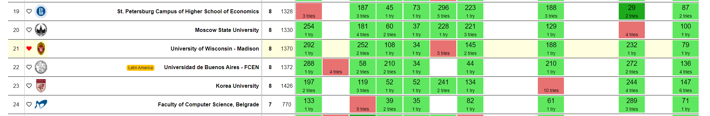
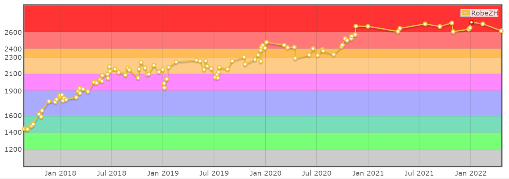

I started doing competitive programming in my undergrad, and I am glad to be a particpant and a coach in the [UW-Madison ICPC Team](https://pages.cs.wisc.edu/~dieter/ICPC/), where I am advised by [Prof. Dieter van Melkebeek](https://pages.cs.wisc.edu/~dieter/).

### Participation
- [Champion](https://ncna19.kattis.com/standings) in 2019 ICPC NCNA Regional with [Viet](https://codeforces.com/profile/bvd) and [Jirayu](https://codeforces.com/profile/top34051).
- [17th place](https://icpc.global/regionals/finder/world-finals-2020/standings) in 2020 ICPC World Finals at Moscow, Russia, with [Jirayu](https://codeforces.com/profile/top34051) and [Nitit](https://codeforces.com/profile/LUL____SEPLED1305). (Our story [here](https://www.cs.wisc.edu/2022/01/25/uw-madison-team-continues-record-20-year-streak-in-icpc-world-finals/)!)

- [Champion](https://ncna21.kattis.com/standings) in 2021 ICPC North Central North America Regional with [Mingrui](https://codeforces.com/profile/Subconscious) and [Nitit](https://codeforces.com/profile/LUL____SEPLED1305).

### Coaching
- led weekly discussion on problems and topics
- organized trainings for the teams.
- attended 2019 ICPC World Finals at Porto, Portugal.

### Online (Gaming)

I, also known as [RobeZH](https://codeforces.com/profile/RobeZH), is an International Grandmaster on Codeforces with a highest rating of 2707 and a highest global rank of 169. I am also active on other sites like [Atcoder](https://atcoder.jp/users/RobeZH), [Codechef](https://www.codechef.com/users/robezh765), etc.

