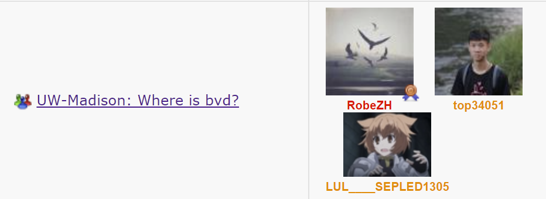
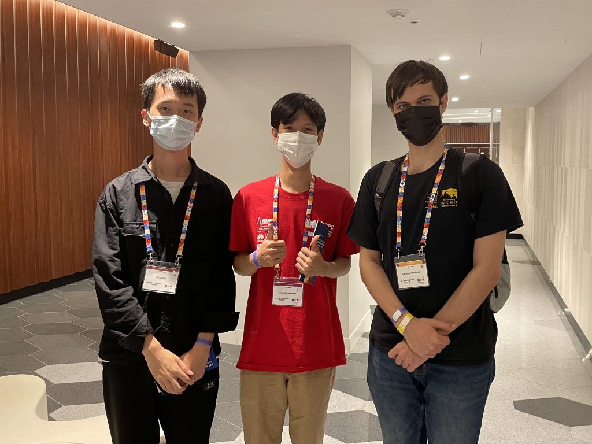
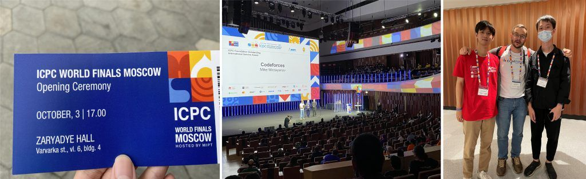
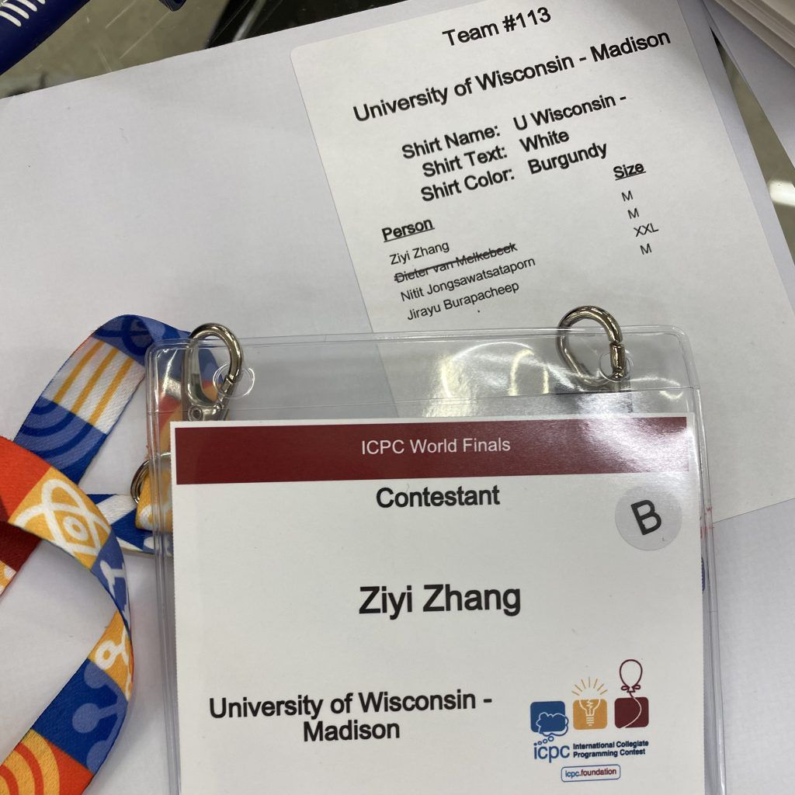
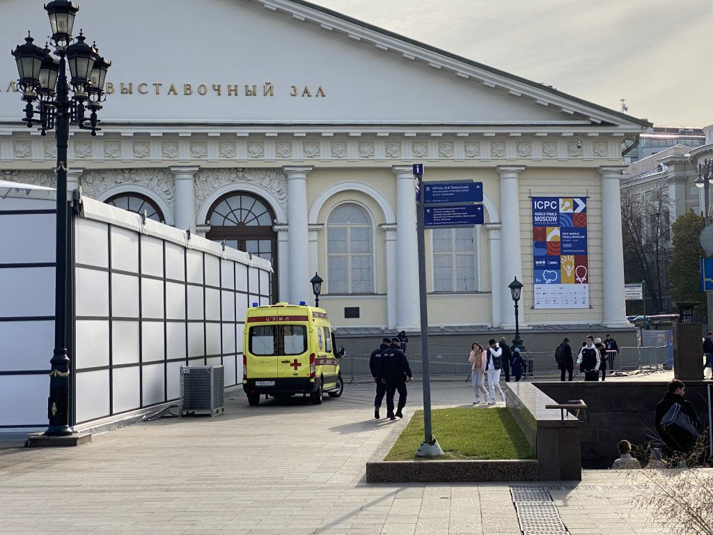
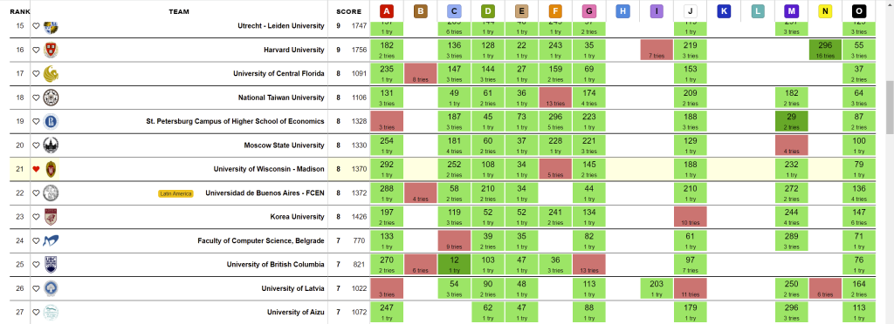
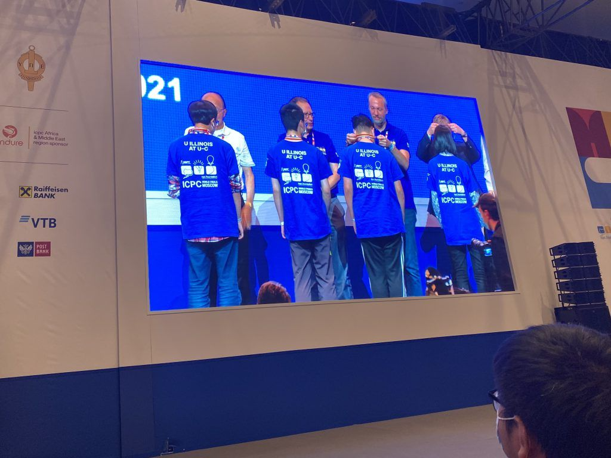
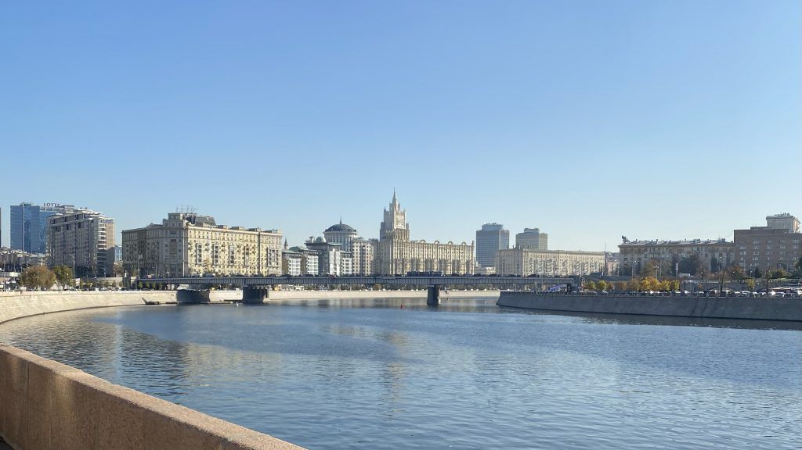

# ICPC WF 2019

原本去年五月份就应该打的比赛，因为疫情踉踉跄跄拖到了现在。结果就是泰国队友Jirayu已经失去了斗志，而另一个队友bvd也因为下个赛季的开始，到了另一个队训练。九月初知道比赛的消息之后，因为bvd美签过期，所以把Nitit换了进来，bvd和新队友去打了邀请赛。

*新队伍*

因为各种情况的出现，也没有对这次比赛有太高的期望，匆匆办好签证，在学校里请好假，就来俄罗斯了。在阿姆斯特丹转机的时候遇到了很多中国学生转机去英国，看起来是赶上英国学校开学季了。

### 来到现场

这次国内的十几个队都没来，观感上看不到中国面孔，也逮不到中国人可以说话。找UIUC的三个中国人结果发现他们还在激烈讨论训练的题目，瑟瑟发抖。然后开幕式前面基了ETH的姚老哥，姚老哥带两个队友飞实在太辛苦了，后来忘记合影，蛮可惜。

有生之年居然看到了tourist现场写码，Kotlin的函数式写法挺吸引人，有机会学一学。开幕式结束跟tourist合了影！有些激动。

*和tourist的合影*

然后结束的晚餐时遇到了Mike。其实我个人对于tourist，更敬仰像Mike这样对community有很大贡献的人，希望以后也有机会成为这样的人。这次又跟Mike合影了，然后他又给了我一些贴纸。

*从左到右依次：开幕式门票，给Codeforces的颁奖，与Mike的合影*

注册的时候，看着自己的牌子，感慨自己终究还是来到了这片最高的竞技场。不过紧张感居然不及当年的区域赛，可能是经过了许多事情后变得笃定了一点吧。

*注册档案和胸牌*

*比赛场地*

### 比赛复盘

*~~略有些~~完全是流水账，见谅。*

开局一直在梦游，看了很多队伍过了D，一直在尝试证贪心的正确性，证了好久被队友喂了一个O。还好期间Jirayu把E过了，不然估计心态要炸。尽管O想到了一个很好写的写法，但是磕磕绊绊写到了79分钟才过，然后花半个小时把D过了。

原本负责写几何题的bvd来不了俄罗斯，换人了，所以赛前商量好策略就是尽量不碰几何。但是当时C已经有很多队伍过了，看起来也是个比较简单的题，有对应的板子，就开始抄。在抄的时候，Jirayu磕磕绊绊写了两个小时终于把G题过了，而我第一发C的提交返回是Wrong Answer，遂走上了几何的不归路。

然后接下来的两个小时，我就在看A和找C的错的过程中不断挣扎，幸亏Nitit在旁边把J题想出来让Jirayu过了，才把节奏往前推了一步。然后三个人讨论M的时候，你一言我一嘴花了五分钟就想出一个很好写的做法？？？于是我马上把M写完直接过了，这个时候已经接近封榜。

封榜前，Jirayu已经把F想出来了想写，但是因为几何两个人都不熟悉，当时顾虑挺大。所以封榜后的策略是争取把A（猜测码量很小）和C过了。没想到查了一会儿终于发现C是犯了比较弱智的错误（int的板子抄过来没把判等于0改成绝对值小于EPS），改完也是直接过了。所以比赛还剩50分钟的时候，Jirayu决定硬怼F，我和Nitit想A。最后A也是顺利想清楚写出来，F还是可惜没有过。

封榜前是26名，公布结果后是21名。如果多加训练的话，肯定能打得更好吧，不会有这么多卡题的情况。不过考虑的队伍一个月前才换了人，而且整个过去一年也几乎没有组队训练，打成这样算是比较圆满的结果。

*排名*

最后半个小时的时候听到了UIUC的欢呼声，知道是封榜后过题了，但没想到是过了三道题，拿到了第11名，祝贺他们拿到奖牌！从去年9月份就觉得是挺厉害的队伍，后来在gym上看到他们训练量也很大，能拿到奖牌不得不服。期待下赛季和他们的交手！

*UIUC上台领取铜牌*

### 赛后

原本定的是比赛结束第二天凌晨的飞机回美国，但出发去机场的时候突然发现新I20的申请还没下来（有些低级），临时决定改签多留两天。正好也趁着这个契机在莫斯科四处走了一走。最后一天阳光正好，塞着耳机听着杨千嬅，走在莫斯科河边，原本还想着学校里的各种破事，看着水上波光粼粼，突然烦恼都消失了。

*莫斯科河*